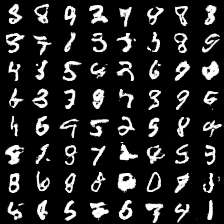
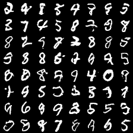
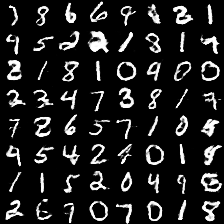
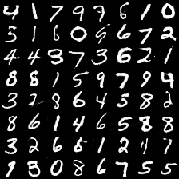
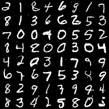
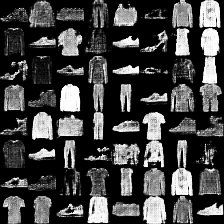
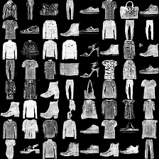
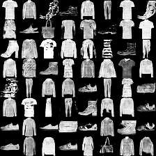

# The original code address
https://github.com/hwalsuklee/tensorflow-generative-model-collections
# tensorflow-generative-model-collections
Tensorflow implementation of various GANs and VAEs.

## Pytorch version
Pytorch Version is now availabel at https://github.com/znxlwm/pytorch-generative-model-collections

## Project progress
It's adapted to the cifar10, celebA. Details can be reached via email.

## Generative Adversarial Networks (GANs)
### Lists  

*Name* | *Paper Link* | *Value Function*
:---: | :---: | :--- |
**GAN** | [Arxiv](https://arxiv.org/abs/1406.2661) | 
**LSGAN**| [Arxiv](https://arxiv.org/abs/1611.04076) | 
**WGAN**| [Arxiv](https://arxiv.org/abs/1701.07875) | 
**WGAN-GP**| [Arxiv](https://arxiv.org/abs/1704.00028) | 
**DRAGAN**| [Arxiv](https://arxiv.org/abs/1705.07215) | 
**CGAN**| [Arxiv](https://arxiv.org/abs/1411.1784) | 
**infoGAN**| [Arxiv](https://arxiv.org/abs/1606.03657) | 
**ACGAN**| [Arxiv](https://arxiv.org/abs/1610.09585) | 
**EBGAN**| [Arxiv](https://arxiv.org/abs/1609.03126) | 
**BEGAN**| [Arxiv](https://arxiv.org/abs/1703.10717) |  
**VAE_GAN**| [Arxiv](https://arxiv.org/abs/1512.09300) | to be add
**SAGAN** | [Arxiv](https://arxiv.org/abs/1805.08318) |  

#### Variants of GAN structure


### Results for mnist
Network architecture of generator and discriminator is the exaclty sames as in [infoGAN paper](https://arxiv.org/abs/1606.03657).  
For fair comparison of core ideas in all gan variants, all implementations for network architecture are kept same except EBGAN and BEGAN. Small modification is made for EBGAN/BEGAN, since those adopt auto-encoder strucutre for discriminator. But I tried to keep the capacity of discirminator.

The following results can be reproduced with command:  
```
python main.py --dataset mnist --gan_type <TYPE> --epoch 25 --batch_size 64
```

#### Random generation
All results are randomly sampled.

*Name* | *Epoch 2* | *Epoch 10* | *Epoch 25*
:---: | :---: | :---: | :---: |
GAN |  |  | 
LSGAN |  |  | 
WGAN |  |  | 
WGAN-GP |  |  | 
DRAGAN |  |  | 
EBGAN |  |  | 
BEGAN |  |  | 
VAE_GAN |  |  | 
SAGAN |  |  | 

#### Conditional generation
Each row has the same noise vector and each column has the same label condition.

*Name* | *Epoch 1* | *Epoch 10* | *Epoch 25*
:---: | :---: | :---: | :---: |
CGAN |  |  | 
ACGAN |  |  | 
infoGAN |  |  | 

#### InfoGAN : Manipulating two continous codes
<table align='center'>
<td></td>
<td></td>
<td></td>
<td></td>
</table>

### Results for fashion-mnist
Comments on network architecture in mnist are also applied to here.  
[Fashion-mnist](https://github.com/zalandoresearch/fashion-mnist) is a recently proposed dataset consisting of a training set of 60,000 examples and a test set of 10,000 examples. Each example is a 28x28 grayscale image, associated with a label from 10 classes. (T-shirt/top, Trouser, Pullover, Dress, Coat, Sandal, Shirt, Sneaker, Bag, Ankle boot)

The following results can be reproduced with command:  
```
python main.py --dataset fashion-mnist --gan_type <TYPE> --epoch 40 --batch_size 64
```

#### Random generation
All results are randomly sampled.

*Name* | *Epoch 1* | *Epoch 20* | *Epoch 40*
:---: | :---: | :---: | :---: |
GAN |  |  | 
LSGAN |  |  | 
WGAN |  |  | 
WGAN-GP |  |  | 
DRAGAN |  |  | 
EBGAN |  |  | 
BEGAN |  |  | 
VAE_GAN | to be add 
SAGAN |  |  | 

#### Conditional generation
Each row has the same noise vector and each column has the same label condition.

*Name* | *Epoch 1* | *Epoch 20* | *Epoch 40*
:---: | :---: | :---: | :---: |
CGAN |  |  | 
ACGAN |  |  | 
infoGAN |  |  | 

Without hyper-parameter tuning from mnist-version, ACGAN/infoGAN does not work well as compared with CGAN.  
ACGAN tends to fall into mode-collapse.  
infoGAN tends to ignore noise-vector. It results in that various style within the same class can not be represented.

#### InfoGAN : Manipulating two continous codes
<table align='center'>
<td></td>
<td></td>
<td></td>
<td></td>
</table>

### Some results for celebA or cifar10
(to be added)

## Variational Auto-Encoders (VAEs)

### Lists

*Name* | *Paper Link* | *Loss Function*
:---: | :---: | :---
**VAE**| [Arxiv](https://arxiv.org/abs/1312.6114) | 
**CVAE**| [Arxiv](https://arxiv.org/abs/1406.5298) | 
**DVAE**| [Arxiv](https://arxiv.org/abs/1511.06406) | (to be added)
**AAE**| [Arxiv](https://arxiv.org/abs/1511.05644) | (to be added) 

#### Variants of VAE structure


### Results for mnist
Network architecture of decoder(generator) and encoder(discriminator) is the exaclty sames as in [infoGAN paper](https://arxiv.org/abs/1606.0365). The number of output nodes in encoder is different. (2x z_dim for VAE, 1 for GAN)

The following results can be reproduced with command:  
```
python main.py --dataset mnist --gan_type <TYPE> --epoch 25 --batch_size 64
```

#### Random generation
All results are randomly sampled.

*Name* | *Epoch 1* | *Epoch 10* | *Epoch 25*
:---: | :---: | :---: | :---: |
VAE |  |  | 
GAN |  |  | 

Results of GAN is also given to compare images generated from VAE and GAN.
The main difference (VAE generates smooth and blurry images, otherwise GAN generates sharp and artifact images) is cleary observed from the results.

#### Conditional generation
Each row has the same noise vector and each column has the same label condition.

*Name* | *Epoch 1* | *Epoch 10* | *Epoch 25*
:---: | :---: | :---: | :---: |
CVAE |  |  | 
CGAN |  |  | 

Results of CGAN is also given to compare images generated from CVAE and CGAN.

#### Learned manifold

The following results can be reproduced with command:  
```
python main.py --dataset mnist --gan_type VAE --epoch 25 --batch_size 64 --dim_z 2
```
Please notice that dimension of noise-vector z is 2.

*Name* | *Epoch 1* | *Epoch 10* | *Epoch 25*
:---: | :---: | :---: | :---: |
VAE |  |  | 

### Results for fashion-mnist
Comments on network architecture in mnist are also applied to here. 

The following results can be reproduced with command:  
```
python main.py --dataset fashion-mnist --gan_type <TYPE> --epoch 40 --batch_size 64
```

#### Random generation
All results are randomly sampled.

*Name* | *Epoch 1* | *Epoch 20* | *Epoch 40*
:---: | :---: | :---: | :---: |
VAE |  |  | 
GAN |  |  | 

Results of GAN is also given to compare images generated from VAE and GAN.

#### Conditional generation
Each row has the same noise vector and each column has the same label condition.

*Name* | *Epoch 1* | *Epoch 20* | *Epoch 40*
:---: | :---: | :---: | :---: |
CVAE |  |  | 
CGAN |  |  | 

Results of CGAN is also given to compare images generated from CVAE and CGAN.

#### Learned manifold

The following results can be reproduced with command:  
```
python main.py --dataset fashion-mnist --gan_type VAE --epoch 25 --batch_size 64 --dim_z 2
```
Please notice that dimension of noise-vector z is 2.

*Name* | *Epoch 1* | *Epoch 10* | *Epoch 25*
:---: | :---: | :---: | :---: |
VAE |  |  | 

### Results for celebA
(We are building, GAN has been adapted)

## Folder structure
The following shows basic folder structure.
```
├── main.py # gateway
├── data
│   ├── mnist # mnist data (not included in this repo)
│   |   ├── t10k-images-idx3-ubyte.gz
│   |   ├── t10k-labels-idx1-ubyte.gz
│   |   ├── train-images-idx3-ubyte.gz
│   |   └── train-labels-idx1-ubyte.gz
│   └── fashion-mnist # fashion-mnist data (not included in this repo)
│       ├── t10k-images-idx3-ubyte.gz
│       ├── t10k-labels-idx1-ubyte.gz
│       ├── train-images-idx3-ubyte.gz
│       └── train-labels-idx1-ubyte.gz
├── GAN.py # vainilla GAN
├── ops.py # some operations on layer
├── utils.py # utils
├── logs # log files for tensorboard to be saved here
└── checkpoint # model files to be saved here
```
### Training Tips
Use SGD for discriminator and ADAM for generator
prepare a new model

## Acknowledgements
This implementation has been based on [this repository](https://github.com/carpedm20/DCGAN-tensorflow) and tested with Tensorflow over ver1.0 on Windows 10 and Ubuntu 14.04.

# GANs Summary
* 3D-GAN - [Learning a Probabilistic Latent Space of Object Shapes via 3D Generative-Adversarial Modeling](https://arxiv.org/abs/1610.07584) ([github](https://github.com/zck119/3dgan-release))
* 3D-IWGAN - [Improved Adversarial Systems for 3D Object Generation and Reconstruction](https://arxiv.org/abs/1707.09557) ([github](https://github.com/EdwardSmith1884/3D-IWGAN))
* 3D-RecGAN - [3D Object Reconstruction from a Single Depth View with Adversarial Learning](https://arxiv.org/abs/1708.07969) ([github](https://github.com/Yang7879/3D-RecGAN))
* ABC-GAN - [ABC-GAN: Adaptive Blur and Control for improved training stability of Generative Adversarial Networks](https://drive.google.com/file/d/0B3wEP_lEl0laVTdGcHE2VnRiMlE/view) ([github](https://github.com/IgorSusmelj/ABC-GAN))
* AC-GAN - [Conditional Image Synthesis With Auxiliary Classifier GANs](https://arxiv.org/abs/1610.09585) 
* acGAN - [Face Aging With Conditional Generative Adversarial Networks](https://arxiv.org/abs/1702.01983) 
* AdaGAN - [AdaGAN: Boosting Generative Models](https://arxiv.org/abs/1701.02386v1) 
* AE-GAN - [AE-GAN: adversarial eliminating with GAN](https://arxiv.org/abs/1707.05474) 
* AEGAN - [Learning Inverse Mapping by Autoencoder based Generative Adversarial Nets](https://arxiv.org/abs/1703.10094) 
* AffGAN - [Amortised MAP Inference for Image Super-resolution](https://arxiv.org/abs/1610.04490) 
* AL-CGAN - [Learning to Generate Images of Outdoor Scenes from Attributes and Semantic Layouts](https://arxiv.org/abs/1612.00215) 
* ALI - [Adversarially Learned Inference](https://arxiv.org/abs/1606.00704) 
* AlignGAN - [AlignGAN: Learning to Align Cross-Domain Images with Conditional Generative Adversarial Networks](https://arxiv.org/abs/1707.01400) 
* AM-GAN - [Activation Maximization Generative Adversarial Nets](https://arxiv.org/abs/1703.02000) 
* AnoGAN - [Unsupervised Anomaly Detection with Generative Adversarial Networks to Guide Marker Discovery](https://arxiv.org/abs/1703.05921v1) 
* ARAE - [Adversarially Regularized Autoencoders for Generating Discrete Structures](https://arxiv.org/abs/1706.04223) ([github](https://github.com/jakezhaojb/ARAE))
* ARDA - [Adversarial Representation Learning for Domain Adaptation](https://arxiv.org/abs/1707.01217) 
* ARIGAN - [ARIGAN: Synthetic Arabidopsis Plants using Generative Adversarial Network](https://arxiv.org/abs/1709.00938) 
* ArtGAN - [ArtGAN: Artwork Synthesis with Conditional Categorial GANs](https://arxiv.org/abs/1702.03410) 
* b-GAN - [Generative Adversarial Nets from a Density Ratio Estimation Perspective](https://arxiv.org/abs/1610.02920) 
* Bayesian GAN - [Deep and Hierarchical Implicit Models](https://arxiv.org/abs/1702.08896) 
* Bayesian GAN - [Bayesian GAN](https://arxiv.org/abs/1705.09558) 
* BCGAN - [Bayesian Conditional Generative Adverserial Networks](https://arxiv.org/abs/1706.05477) 
* BEGAN - [BEGAN: Boundary Equilibrium Generative Adversarial Networks](https://arxiv.org/abs/1703.10717) 
* BGAN - [Binary Generative Adversarial Networks for Image Retrieval](https://arxiv.org/abs/1708.04150) ([github](https://github.com/htconquer/BGAN))
* BiGAN - [Adversarial Feature Learning](https://arxiv.org/abs/1605.09782v7) 
* BS-GAN - [Boundary-Seeking Generative Adversarial Networks](https://arxiv.org/abs/1702.08431v1) 
* C-RNN-GAN - [C-RNN-GAN: Continuous recurrent neural networks with adversarial training](https://arxiv.org/abs/1611.09904) ([github](https://github.com/olofmogren/c-rnn-gan/))
* CaloGAN - [CaloGAN: Simulating 3D High Energy Particle Showers in Multi-Layer Electromagnetic Calorimeters with Generative Adversarial Networks](https://arxiv.org/abs/1705.02355) ([github](https://github.com/hep-lbdl/CaloGAN))
* CAN - [CAN: Creative Adversarial Networks, Generating Art by Learning About Styles and Deviating from Style Norms](https://arxiv.org/abs/1706.07068) 
* CatGAN - [Unsupervised and Semi-supervised Learning with Categorical Generative Adversarial Networks](https://arxiv.org/abs/1511.06390v2) 
* CausalGAN - [CausalGAN: Learning Causal Implicit Generative Models with Adversarial Training](https://arxiv.org/abs/1709.02023) 
* CC-GAN - [Semi-Supervised Learning with Context-Conditional Generative Adversarial Networks](https://arxiv.org/abs/1611.06430) ([github](https://github.com/edenton/cc-gan))
* CDcGAN - [Simultaneously Color-Depth Super-Resolution with Conditional Generative Adversarial Network](https://arxiv.org/abs/1708.09105) 
* CGAN - [Conditional Generative Adversarial Nets](https://arxiv.org/abs/1411.1784) 
* CGAN - [Controllable Generative Adversarial Network](https://arxiv.org/abs/1708.00598) 
* Chekhov GAN - [An Online Learning Approach to Generative Adversarial Networks](https://arxiv.org/abs/1706.03269) 
* CM-GAN - [CM-GANs: Cross-modal Generative Adversarial Networks for Common Representation Learning](https://arxiv.org/abs/1710.05106) 
* CoGAN - [Coupled Generative Adversarial Networks](https://arxiv.org/abs/1606.07536v2) 
* Conditional cycleGAN - [Conditional CycleGAN for Attribute Guided Face Image Generation](https://arxiv.org/abs/1705.09966) 
* constrast-GAN - [Generative Semantic Manipulation with Contrasting GAN](https://arxiv.org/abs/1708.00315) 
* Context-RNN-GAN - [Contextual RNN-GANs for Abstract Reasoning Diagram Generation](https://arxiv.org/abs/1609.09444) 
* Coulomb GAN - [Coulomb GANs: Provably Optimal Nash Equilibria via Potential Fields](https://arxiv.org/abs/1708.08819) 
* Cramèr GAN  - [The Cramer Distance as a Solution to Biased Wasserstein Gradients](https://arxiv.org/abs/1705.10743) 
* crVAE-GAN - [Channel-Recurrent Variational Autoencoders](https://arxiv.org/abs/1706.03729) 
* CS-GAN - [Improving Neural Machine Translation with Conditional Sequence Generative Adversarial Nets](https://arxiv.org/abs/1703.04887) 
* CVAE-GAN - [CVAE-GAN: Fine-Grained Image Generation through Asymmetric Training](https://arxiv.org/abs/1703.10155) 
* CycleGAN - [Unpaired Image-to-Image Translation using Cycle-Consistent Adversarial Networks](https://arxiv.org/abs/1703.10593) ([github](https://github.com/junyanz/CycleGAN))
* D2GAN - [Dual Discriminator Generative Adversarial Nets](http://arxiv.org/abs/1709.03831) 
* DAN - [Distributional Adversarial Networks](https://arxiv.org/abs/1706.09549) 
* DCGAN - [Unsupervised Representation Learning with Deep Convolutional Generative Adversarial Networks](https://arxiv.org/abs/1511.06434) ([github](https://github.com/Newmu/dcgan_code))
* DeliGAN - [DeLiGAN : Generative Adversarial Networks for Diverse and Limited Data](https://arxiv.org/abs/1706.02071) ([github](https://github.com/val-iisc/deligan))
* DiscoGAN - [Learning to Discover Cross-Domain Relations with Generative Adversarial Networks](https://arxiv.org/abs/1703.05192v1) 
* DistanceGAN - [One-Sided Unsupervised Domain Mapping](https://arxiv.org/abs/1706.00826) 
* DM-GAN - [Dual Motion GAN for Future-Flow Embedded Video Prediction](https://arxiv.org/abs/1708.00284) 
* DR-GAN - [Representation Learning by Rotating Your Faces](https://arxiv.org/abs/1705.11136) 
* DRAGAN - [How to Train Your DRAGAN](https://arxiv.org/abs/1705.07215) ([github](https://github.com/kodalinaveen3/DRAGAN))
* DSP-GAN - [Depth Structure Preserving Scene Image Generation](https://arxiv.org/abs/1706.00212) 
* DTN - [Unsupervised Cross-Domain Image Generation](https://arxiv.org/abs/1611.02200) 
* DualGAN - [DualGAN: Unsupervised Dual Learning for Image-to-Image Translation](https://arxiv.org/abs/1704.02510v1) 
* Dualing GAN - [Dualing GANs](https://arxiv.org/abs/1706.06216) 
* EBGAN - [Energy-based Generative Adversarial Network](https://arxiv.org/abs/1609.03126v4) 
* ED//GAN - [Stabilizing Training of Generative Adversarial Networks through Regularization](https://arxiv.org/abs/1705.09367) 
* EGAN - [Enhanced Experience Replay Generation for Efficient Reinforcement Learning](https://arxiv.org/abs/1705.08245) 
* ExprGAN - [ExprGAN: Facial Expression Editing with Controllable Expression Intensity](https://arxiv.org/abs/1709.03842) 
* f-GAN - [f-GAN: Training Generative Neural Samplers using Variational Divergence Minimization](https://arxiv.org/abs/1606.00709) 
* FF-GAN - [Towards Large-Pose Face Frontalization in the Wild](https://arxiv.org/abs/1704.06244) 
* Fila-GAN - [Synthesizing Filamentary Structured Images with GANs](https://arxiv.org/abs/1706.02185) 
* Fisher GAN - [Fisher GAN](https://arxiv.org/abs/1705.09675) 
* Flow-GAN - [Flow-GAN: Bridging implicit and prescribed learning in generative models](https://arxiv.org/abs/1705.08868) 
* GAMN - [Generative Adversarial Mapping Networks](https://arxiv.org/abs/1709.09820) 
* GAN - [Generative Adversarial Networks](https://arxiv.org/abs/1406.2661) ([github](https://github.com/goodfeli/adversarial))
* GAN-CLS - [Generative Adversarial Text to Image Synthesis](https://arxiv.org/abs/1605.05396) ([github](https://github.com/reedscot/icml2016))
* GAN-sep - [GANs for Biological Image Synthesis](https://arxiv.org/abs/1708.04692) ([github](https://github.com/aosokin/biogans))
* GAN-VFS - [Generative Adversarial Network-based Synthesis of Visible Faces from Polarimetric Thermal Faces](https://arxiv.org/abs/1708.02681) 
* GANCS - [Deep Generative Adversarial Networks for Compressed Sensing Automates MRI](https://arxiv.org/abs/1706.00051) 
* GAP - [Context-Aware Generative Adversarial Privacy](https://arxiv.org/abs/1710.09549) 
* GAWWN - [Learning What and Where to Draw](https://arxiv.org/abs/1610.02454) ([github](https://github.com/reedscot/nips2016))
* GeneGAN - [GeneGAN: Learning Object Transfiguration and Attribute Subspace from Unpaired Data](https://arxiv.org/abs/1705.04932) ([github](https://github.com/Prinsphield/GeneGAN))
* Geometric GAN - [Geometric GAN](https://arxiv.org/abs/1705.02894) 
* GMAN - [Generative Multi-Adversarial Networks](http://arxiv.org/abs/1611.01673) 
* GMM-GAN - [Towards Understanding the Dynamics of Generative Adversarial Networks](https://arxiv.org/abs/1706.09884) 
* GoGAN - [Gang of GANs: Generative Adversarial Networks with Maximum Margin Ranking](https://arxiv.org/abs/1704.04865) 
* GP-GAN - [GP-GAN: Towards Realistic High-Resolution Image Blending](https://arxiv.org/abs/1703.07195) ([github](https://github.com/wuhuikai/GP-GAN))
* GP-GAN - [GP-GAN: Gender Preserving GAN for Synthesizing Faces from Landmarks](https://arxiv.org/abs/1710.00962) 
* GRAN - [Generating images with recurrent adversarial networks](https://arxiv.org/abs/1602.05110) ([github](https://github.com/jiwoongim/GRAN))
* IAN - [Neural Photo Editing with Introspective Adversarial Networks](https://arxiv.org/abs/1609.07093) ([github](https://github.com/ajbrock/Neural-Photo-Editor))
* IcGAN - [Invertible Conditional GANs for image editing](https://arxiv.org/abs/1611.06355) ([github](https://github.com/Guim3/IcGAN))
* ID-CGAN - [Image De-raining Using a Conditional Generative Adversarial Network](https://arxiv.org/abs/1701.05957v3) 
* iGAN - [Generative Visual Manipulation on the Natural Image Manifold](https://arxiv.org/abs/1609.03552v2) ([github](https://github.com/junyanz/iGAN))
* Improved GAN - [Improved Techniques for Training GANs](https://arxiv.org/abs/1606.03498) ([github](https://github.com/openai/improved-gan))
* InfoGAN - [InfoGAN: Interpretable Representation Learning by Information Maximizing Generative Adversarial Nets](https://arxiv.org/abs/1606.03657v1) ([github](https://github.com/openai/InfoGAN))
* IRGAN - [IRGAN: A Minimax Game for Unifying Generative and Discriminative Information Retrieval models](https://arxiv.org/abs/1705.10513v1) 
* IWGAN - [On Unifying Deep Generative Models](https://arxiv.org/abs/1706.00550) 
* l-GAN - [Representation Learning and Adversarial Generation of 3D Point Clouds](https://arxiv.org/abs/1707.02392) 
* LAGAN - [Learning Particle Physics by Example: Location-Aware Generative Adversarial Networks for Physics Synthesis](https://arxiv.org/abs/1701.05927) 
* LAPGAN - [Deep Generative Image Models using a Laplacian Pyramid of Adversarial Networks](https://arxiv.org/abs/1506.05751) ([github](https://github.com/facebook/eyescream))
* LD-GAN - [Linear Discriminant Generative Adversarial Networks](https://arxiv.org/abs/1707.07831) 
* LDAN - [Label Denoising Adversarial Network (LDAN) for Inverse Lighting of Face Images](https://arxiv.org/abs/1709.01993) 
* LeakGAN - [Long Text Generation via Adversarial Training with Leaked Information](https://arxiv.org/abs/1709.08624) 
* LeGAN - [Likelihood Estimation for Generative Adversarial Networks](https://arxiv.org/abs/1707.07530) 
* LR-GAN - [LR-GAN: Layered Recursive Generative Adversarial Networks for Image Generation](https://arxiv.org/abs/1703.01560v1) 
* LS-GAN - [Loss-Sensitive Generative Adversarial Networks on Lipschitz Densities](https://arxiv.org/abs/1701.06264) 
* LSGAN - [Least Squares Generative Adversarial Networks](https://arxiv.org/abs/1611.04076v3) 
* MAD-GAN - [Multi-Agent Diverse Generative Adversarial Networks](https://arxiv.org/abs/1704.02906) 
* MAGAN - [MAGAN: Margin Adaptation for Generative Adversarial Networks](https://arxiv.org/abs/1704.03817v1) 
* MalGAN - [Generating Adversarial Malware Examples for Black-Box Attacks Based on GAN](https://arxiv.org/abs/1702.05983v1) 
* MaliGAN - [Maximum-Likelihood Augmented Discrete Generative Adversarial Networks](https://arxiv.org/abs/1702.07983) 
* MARTA-GAN - [Deep Unsupervised Representation Learning for Remote Sensing Images](https://arxiv.org/abs/1612.08879) 
* McGAN - [McGan: Mean and Covariance Feature Matching GAN](https://arxiv.org/abs/1702.08398v1) 
* MD-GAN - [Learning to Generate Time-Lapse Videos Using Multi-Stage Dynamic Generative Adversarial Networks](https://arxiv.org/abs/1709.07592) 
* MDGAN - [Mode Regularized Generative Adversarial Networks](https://arxiv.org/abs/1612.02136) 
* MedGAN - [Generating Multi-label Discrete Electronic Health Records using Generative Adversarial Networks](https://arxiv.org/abs/1703.06490v1) 
* MGAN - [Precomputed Real-Time Texture Synthesis with Markovian Generative Adversarial Networks](https://arxiv.org/abs/1604.04382) ([github](https://github.com/chuanli11/MGANs))
* MGGAN - [Multi-Generator Generative Adversarial Nets](https://arxiv.org/abs/1708.02556) 
* MIX+GAN - [Generalization and Equilibrium in Generative Adversarial Nets (GANs)](https://arxiv.org/abs/1703.00573v3) 
* MMD-GAN - [MMD GAN: Towards Deeper Understanding of Moment Matching Network](https://arxiv.org/abs/1705.08584) ([github](https://github.com/dougalsutherland/opt-mmd))
* MMGAN - [MMGAN: Manifold Matching Generative Adversarial Network for Generating Images](https://arxiv.org/abs/1707.08273) 
* MoCoGAN - [MoCoGAN: Decomposing Motion and Content for Video Generation](https://arxiv.org/abs/1707.04993) ([github](https://github.com/sergeytulyakov/mocogan))
* MPM-GAN - [Message Passing Multi-Agent GANs](https://arxiv.org/abs/1612.01294) 
* MuseGAN - [MuseGAN: Symbolic-domain Music Generation and Accompaniment with Multi-track Sequential Generative Adversarial Networks](https://arxiv.org/abs/1709.06298) 
* MV-BiGAN - [Multi-view Generative Adversarial Networks](https://arxiv.org/abs/1611.02019v1) 
* OptionGAN - [OptionGAN: Learning Joint Reward-Policy Options using Generative Adversarial Inverse Reinforcement Learning](https://arxiv.org/abs/1709.06683) 
* ORGAN - [Objective-Reinforced Generative Adversarial Networks (ORGAN) for Sequence Generation Models ](https://arxiv.org/abs/1705.10843) 
* PAN - [Perceptual Adversarial Networks for Image-to-Image Transformation](https://arxiv.org/abs/1706.09138) 
* PassGAN - [PassGAN: A Deep Learning Approach for Password Guessing](https://arxiv.org/abs/1709.00440) 
* Perceptual GAN - [Perceptual Generative Adversarial Networks for Small Object Detection](https://arxiv.org/abs/1706.05274) 
* PGAN - [Probabilistic Generative Adversarial Networks](https://arxiv.org/abs/1708.01886) 
* pix2pix - [Image-to-Image Translation with Conditional Adversarial Networks](https://arxiv.org/abs/1611.07004) ([github](https://github.com/phillipi/pix2pix))
* PixelGAN - [PixelGAN Autoencoders](https://arxiv.org/abs/1706.00531) 
* Pose-GAN - [The Pose Knows: Video Forecasting by Generating Pose Futures](https://arxiv.org/abs/1705.00053) 
* PPGN - [Plug & Play Generative Networks: Conditional Iterative Generation of Images in Latent Space](https://arxiv.org/abs/1612.00005) 
* PrGAN - [3D Shape Induction from 2D Views of Multiple Objects](https://arxiv.org/abs/1612.05872) 
* PSGAN - [Learning Texture Manifolds with the Periodic Spatial GAN](http://arxiv.org/abs/1705.06566) 
* RankGAN - [Adversarial Ranking for Language Generation ](https://arxiv.org/abs/1705.11001) 
* RCGAN - [Real-valued (Medical) Time Series Generation with Recurrent Conditional GANs](https://arxiv.org/abs/1706.02633) 
* RefineGAN - [Compressed Sensing MRI Reconstruction with Cyclic Loss in Generative Adversarial Networks](https://arxiv.org/abs/1709.00753) 
* RenderGAN - [RenderGAN: Generating Realistic Labeled Data](https://arxiv.org/abs/1611.01331) 
* ResGAN - [Generative Adversarial Network based on Resnet for Conditional Image Restoration](https://arxiv.org/abs/1707.04881) 
* RNN-WGAN - [Language Generation with Recurrent Generative Adversarial Networks without Pre-training](https://arxiv.org/abs/1706.01399) ([github](https://github.com/amirbar/rnn.wgan))
* RPGAN - [Stabilizing GAN Training with Multiple Random Projections](https://arxiv.org/abs/1705.07831) ([github](https://github.com/ayanc/rpgan))
* RTT-GAN - [Recurrent Topic-Transition GAN for Visual Paragraph Generation](https://arxiv.org/abs/1703.07022v2) 
* RWGAN - [Relaxed Wasserstein with Applications to GANs](https://arxiv.org/abs/1705.07164) 
* SAD-GAN - [SAD-GAN: Synthetic Autonomous Driving using Generative Adversarial Networks](https://arxiv.org/abs/1611.08788v1) 
* SalGAN - [SalGAN: Visual Saliency Prediction with Generative Adversarial Networks](https://arxiv.org/abs/1701.01081) ([github](https://github.com/imatge-upc/saliency-salgan-2017))
* SBADA-GAN - [From source to target and back: symmetric bi-directional adaptive GAN](https://arxiv.org/abs/1705.08824) 
* SD-GAN - [Semantically Decomposing the Latent Spaces of Generative Adversarial Networks](https://arxiv.org/abs/1705.07904) 
* SEGAN - [SEGAN: Speech Enhancement Generative Adversarial Network](https://arxiv.org/abs/1703.09452v1) 
* SeGAN - [SeGAN: Segmenting and Generating the Invisible](https://arxiv.org/abs/1703.10239) 
* SegAN - [SegAN: Adversarial Network with Multi-scale L1 Loss for Medical Image Segmentation](https://arxiv.org/abs/1706.01805) 
* SeqGAN - [SeqGAN: Sequence Generative Adversarial Nets with Policy Gradient](https://arxiv.org/abs/1609.05473v5) ([github](https://github.com/LantaoYu/SeqGAN))
* SGAN - [Texture Synthesis with Spatial Generative Adversarial Networks](https://arxiv.org/abs/1611.08207) 
* SGAN - [Stacked Generative Adversarial Networks](https://arxiv.org/abs/1612.04357v4) ([github](https://github.com/xunhuang1995/SGAN))
* SGAN - [Steganographic Generative Adversarial Networks](https://arxiv.org/abs/1703.05502) 
* SimGAN - [Learning from Simulated and Unsupervised Images through Adversarial Training](https://arxiv.org/abs/1612.07828) 
* SketchGAN - [Adversarial Training For Sketch Retrieval](https://arxiv.org/abs/1607.02748) 
* SL-GAN - [Semi-Latent GAN: Learning to generate and modify facial images from attributes](https://arxiv.org/abs/1704.02166) 
* SN-GAN - [Spectral Normalization for Generative Adversarial Networks](https://drive.google.com/file/d/0B8HZ50DPgR3eSVV6YlF3XzQxSjQ/view) ([github](https://github.com/pfnet-research/chainer-gan-lib))
* Softmax-GAN - [Softmax GAN](https://arxiv.org/abs/1704.06191) 
* Splitting GAN - [Class-Splitting Generative Adversarial Networks](https://arxiv.org/abs/1709.07359) 
* SRGAN - [Photo-Realistic Single Image Super-Resolution Using a Generative Adversarial Network](https://arxiv.org/abs/1609.04802) 
* SS-GAN - [Semi-supervised Conditional GANs](https://arxiv.org/abs/1708.05789) 
* ss-InfoGAN - [Guiding InfoGAN with Semi-Supervision](https://arxiv.org/abs/1707.04487) 
* SSGAN - [SSGAN: Secure Steganography Based on Generative Adversarial Networks](https://arxiv.org/abs/1707.01613) 
* SSL-GAN - [Semi-Supervised Learning with Context-Conditional Generative Adversarial Networks](https://arxiv.org/abs/1611.06430v1) 
* ST-GAN - [Style Transfer Generative Adversarial Networks: Learning to Play Chess Differently](https://arxiv.org/abs/1702.06762) 
* StackGAN - [StackGAN: Text to Photo-realistic Image Synthesis with Stacked Generative Adversarial Networks](https://arxiv.org/abs/1612.03242v1) 
* SteinGAN - [Learning Deep Energy Models: Contrastive Divergence vs. Amortized MLE](https://arxiv.org/abs/1707.00797) 
* S^2GAN - [Generative Image Modeling using Style and Structure Adversarial Networks](https://arxiv.org/abs/1603.05631v2) 
* TAC-GAN - [TAC-GAN - Text Conditioned Auxiliary Classifier Generative Adversarial Network](https://arxiv.org/abs/1703.06412v2) ([github](https://github.com/dashayushman/TAC-GAN))
* TAN - [Outline Colorization through Tandem Adversarial Networks](https://arxiv.org/abs/1704.08834) 
* TextureGAN - [TextureGAN: Controlling Deep Image Synthesis with Texture Patches](https://arxiv.org/abs/1706.02823) 
* TGAN - [Temporal Generative Adversarial Nets](https://arxiv.org/abs/1611.06624v1) 
* TP-GAN - [Beyond Face Rotation: Global and Local Perception GAN for Photorealistic and Identity Preserving Frontal View Synthesis](https://arxiv.org/abs/1704.04086) 
* Triple-GAN - [Triple Generative Adversarial Nets](https://arxiv.org/abs/1703.02291v2) 
* Unrolled GAN - [Unrolled Generative Adversarial Networks](https://arxiv.org/abs/1611.02163) ([github](https://github.com/poolio/unrolled_gan))
* VAE-GAN - [Autoencoding beyond pixels using a learned similarity metric](https://arxiv.org/abs/1512.09300) 
* VariGAN - [Multi-View Image Generation from a Single-View](https://arxiv.org/abs/1704.04886) 
* VAW-GAN - [Voice Conversion from Unaligned Corpora using Variational Autoencoding Wasserstein Generative Adversarial Networks](https://arxiv.org/abs/1704.00849) 
* VEEGAN - [VEEGAN: Reducing Mode Collapse in GANs using Implicit Variational Learning](https://arxiv.org/abs/1705.07761) ([github](https://github.com/akashgit/VEEGAN))
* VGAN - [Generating Videos with Scene Dynamics](https://arxiv.org/abs/1609.02612) ([github](https://github.com/cvondrick/videogan))
* VGAN - [Generative Adversarial Networks as Variational Training of Energy Based Models](https://arxiv.org/abs/1611.01799) ([github](https://github.com/Shuangfei/vgan))
* ViGAN - [Image Generation and Editing with Variational Info Generative Adversarial Networks](https://arxiv.org/abs/1701.04568v1) 
* VIGAN - [VIGAN: Missing View Imputation with Generative Adversarial Networks](https://arxiv.org/abs/1708.06724) 
* VRAL - [Variance Regularizing Adversarial Learning](https://arxiv.org/abs/1707.00309) 
* WaterGAN - [WaterGAN: Unsupervised Generative Network to Enable Real-time Color Correction of Monocular Underwater Images](https://arxiv.org/abs/1702.07392v1) 
* WGAN - [Wasserstein GAN](https://arxiv.org/abs/1701.07875v2) ([github](https://github.com/martinarjovsky/WassersteinGAN))
* WGAN-GP - [Improved Training of Wasserstein GANs](https://arxiv.org/abs/1704.00028) ([github](https://github.com/igul222/improved_wgan_training))
* WS-GAN - [Weakly Supervised Generative Adversarial Networks for 3D Reconstruction ](https://arxiv.org/abs/1705.10904) 
* α-GAN - [Variational Approaches for Auto-Encoding Generative Adversarial Networks](https://arxiv.org/abs/1706.04987) ([github](https://github.com/victor-shepardson/alpha-GAN))
* Δ-GAN - [Triangle Generative Adversarial Networks](https://arxiv.org/abs/1709.06548) 
